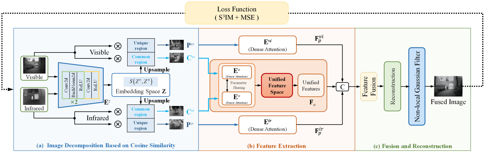
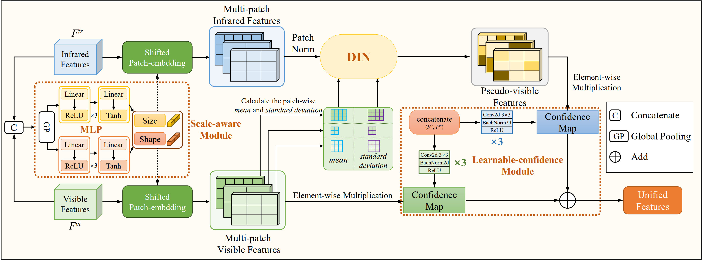
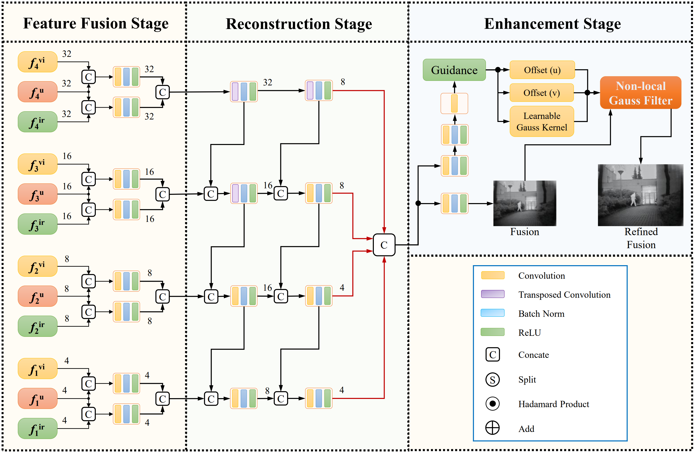
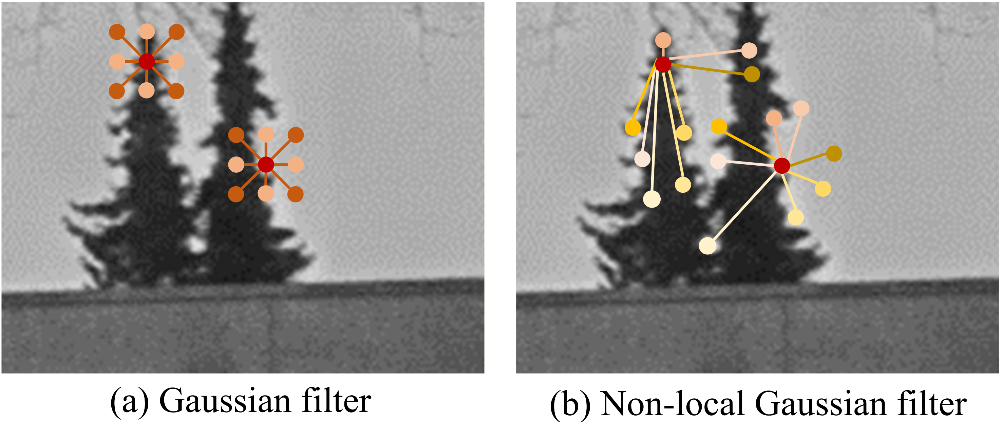
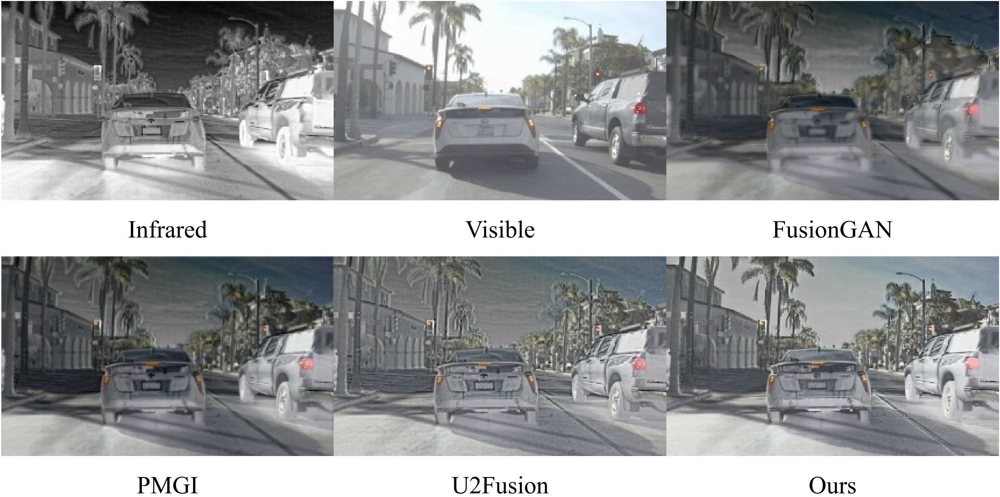

# DNFusion

code for DNFuison: Infrared-Visible Image Fusion through Feature-Based Decomposition and Domain Normalization

[Weiyi Chen](https://github.com/wyhlaowang/DNFusion), 
[Lingjuan Miao](https://github.com/wyhlaowang/DNFusion), 
[Yuhao Wang](https://github.com/wyhlaowang/DNFusion)
[Zhiqiang Zhou](https://github.com/bitzhouzq) and 
[Yajun Qiao](https://github.com/QYJ123/)

# Usage
**1. Create Environment**
```
# install cuda
Recommended cuda11.1

# create conda environment
conda create -n LDFusion python=3.9.12
conda activate LDFusion

# select pytorch version yourself (recommended torch 1.8.2)
# install DDFM requirements
pip install -r requirements.txt
```

**2. Data Preparation, training and inference**

You can put your own test data directly into the ```test_imgs/rs``` directory, and run ```python test.py``` at directory of ```./src/```.

Then, the fused results will be saved in the ```./self_results/rs/``` folder.

If you want to train the model with your own data, change the value of ```data_dir``` in the ```m3fd.py``` file to the address of your dataset.

We recommend inference and training in cuda because DCN libraries do not run well in cpu.

# DNFusion


Our proposed UNIFusion is an autoencoder structure, which consists of image decomposition, feature extraction, fusion, and reconstruction modules. The~feature extraction module is a three-branch network based on dense attention, consisting of encoders E_ir, E_vi, and E_u_, which are used to extract unique and unified features. 



The fusion and reconstruction module is devised to fuse features and generate fusion results, while employing a non-local Gaussian filter to reduce the adverse impact of noise on the fusion quality. 



Specifically, we decompose infrared--visible images into common regions (C_vi and C_ir) and unique regions (P_vi and P_ir). The~dense attention is leveraged to effectively extract features from the common and unique regions. 


To eliminate modal differences, we propose the unified feature space to transform infrared features into the pseudo-visible domain. As noisy source images may degrade the fusion quality, we design a non-local Gaussian filter to minimize the impact of noise on the fusion results while maintaining the image~details.



# Fusion Results



